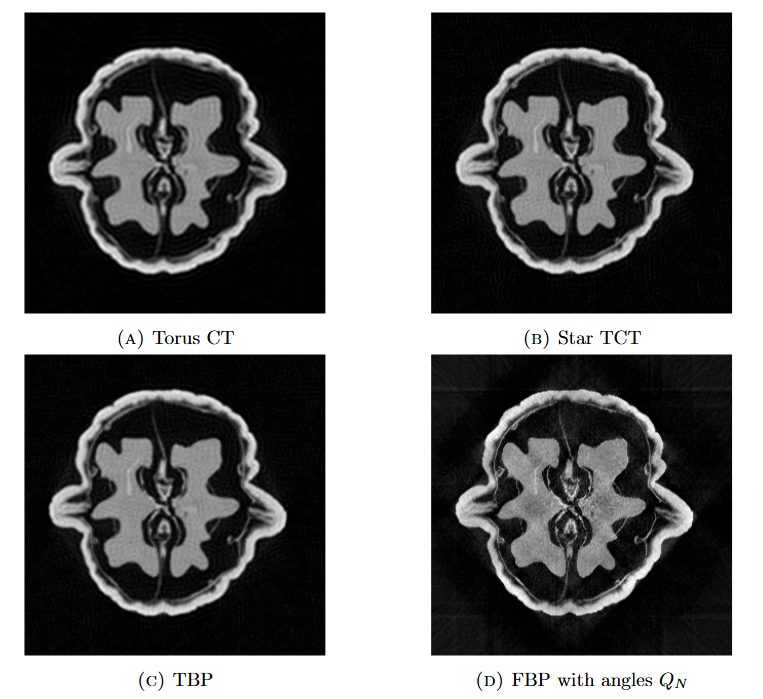

# Torus Computed Tomography

MATLAB implementation of Torus Computed Tomography (Torus CT) and its extensions developed in

 E. Salo, A. Meaney, O. Koskela and J. Railo *Torus Computed Tomography for Experimental Data*.

Torus CT is a Fourier-based tomographic reconstruction method built on the geodesic X-ray transform on the flat torus. The method recovers Fourier coefficients from projection data measured along closed geodesic directions. Star TCT extends the recoverable frequency range, while Torus Backprojection (TBP) provides an alternative reconstruction approach based on summation over torus directions.

For details of the mathematical theory, numerical implementation, and experimental results, we refer to the accompanying article.

This repository contains implementations of
- Torus CT
- Star TCT
- Torus Backprojection (TBP) and its filtered variants (fFTBP and cFTBP)

 

  <em>Experimental walnut reconstructions using Torus CT, Star TCT, TBP and FBP with a Fourier coefficient box size N=50.</em>

## Requirements
- MATLAB R2023b or newer
- Image Processing Toolbox

## Simulated data experiments
To reproduce the simulated data experiments, run

`main_simulated_data.m`

The script generates simulated projection data, computes the reconstruction using user selected method (Torus CT, Star TCT or TBP), and evaluates reconstruction errors.

## Experimental walnut data experiments
To reproduce the experimental data experiments, run

`main_real_data.m`

## Walnut dataset

The original dataset is licensed under CC BY 4.0. Users should cite the original dataset publication when using the data. 

K. Hämäläinen, L. Harhanen, A. Kallonen, A. Kujanpää, E. Niemi and S. Siltanen *Tomographic X-ray data of a walnut*.

Documentation at arXiv: 
https://arxiv.org/abs/1502.04064.

Dataset: 
https://doi.org/10.5281/zenodo.1254206.

The reconstructions use the dataset `sinogram1200` stored in `FullSizeSinograms.mat`.

The required data are provided in the folder `walnut_data`.

## Acknowledgements

The original Torus CT method was introduced in
J. Ilmavirta, O. Koskela and J. Railo, *Torus Computed Tomography*, arXiv:1906.05046, 2019.

The original MATLAB implementation of Torus CT was developed by
O. Koskela and J. Railo, *MATLAB implementation of Torus CT*, Zenodo, 2019, https://doi.org/10.5281/zenodo.3243363.

The development of this repository was based on an unpublished research version of the Torus CT MATLAB codes. The code in this repository has been revised, corrected, and substantially extended to support experimental fan-beam datasets, Star TCT, Torus Backprojection (TBP), filtered TBP methods, positivity-constrained reconstructions, and additional numerical experiments.

The synthetic-data generation used for the FBP comparison follows the no-inverse-crime methodology of
J. L. Mueller and S. Siltanen, *Linear and Nonlinear Inverse Problems with Practical Applications*, SIAM, 2012.

In particular, the implementation of `create_radon_data_no_crime.m` follows the supplementary MATLAB example `XRA_NoCrimeData_comp.m` accompanying the book.
